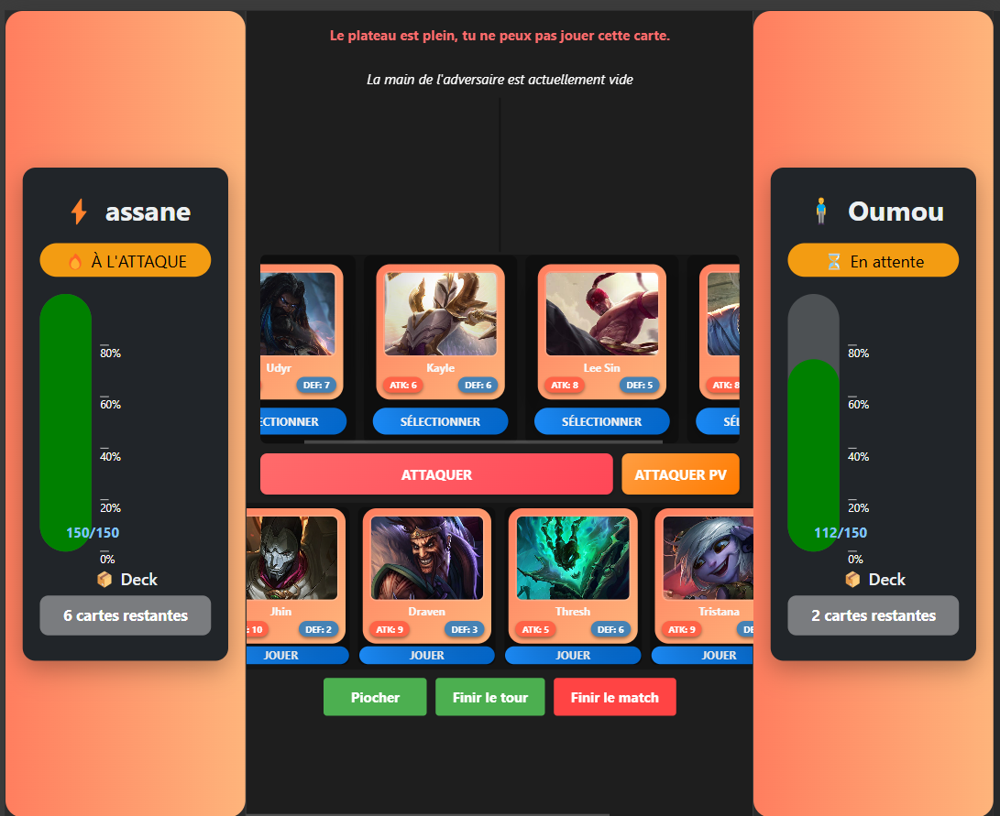

# League Of Stones - Projet WEB2  
  
## Présentation du projet  

**League Of Stones** est un mashup innovant combinant les mécaniques de jeu de *Hearthstone* (Blizzard™) avec l'univers et les champions de *League of Legends* (Riot Games™).  

### Concept clé  
- **Affrontement** : 2 joueurs, 20 cartes/deck, 150 PV chacun  
- **Déroulement** : Tours alternés avec 3 actions possibles :  
  1. Piocher une carte (1x/tour)  
  2. Poser une carte (max 5 sur le plateau)  
  3. Attaquer (1x/carte/tour)  

## Fonctionnalités implémentées  

### Gestion utilisateur  
- Création de compte (email + mot de passe)  
- Connexion/déconnexion  
- Suppression de compte  

### Matchmaking  
- Liste des joueurs disponibles  
- Envoi/Acceptation de défis  
- Création automatique de matchs  

### Système de jeu  
- Constitution de deck (20 cartes max)  
- Mécaniques de pioche/pose/attaque  
- Résolution des combats (PV, attaque/défense)  
- Gestion de fin de partie  

## Technologies utilisées  

**Frontend:**  
- React.js (application web responsive)  
- [Bonus] Version mobile (React Native ou PWA)  

**Backend:**  
- Web Services REST (fournis)  
- MongoDB (base de données)  
- Express.js (serveur)  

## Architecture du projet  
